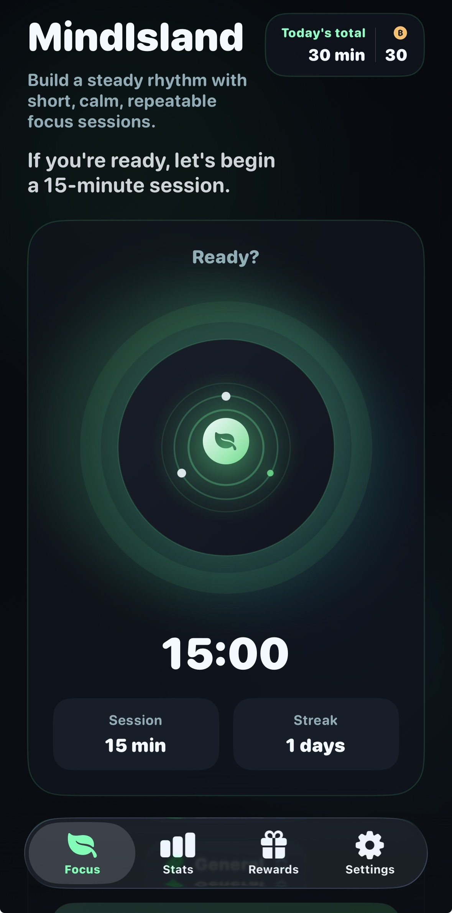
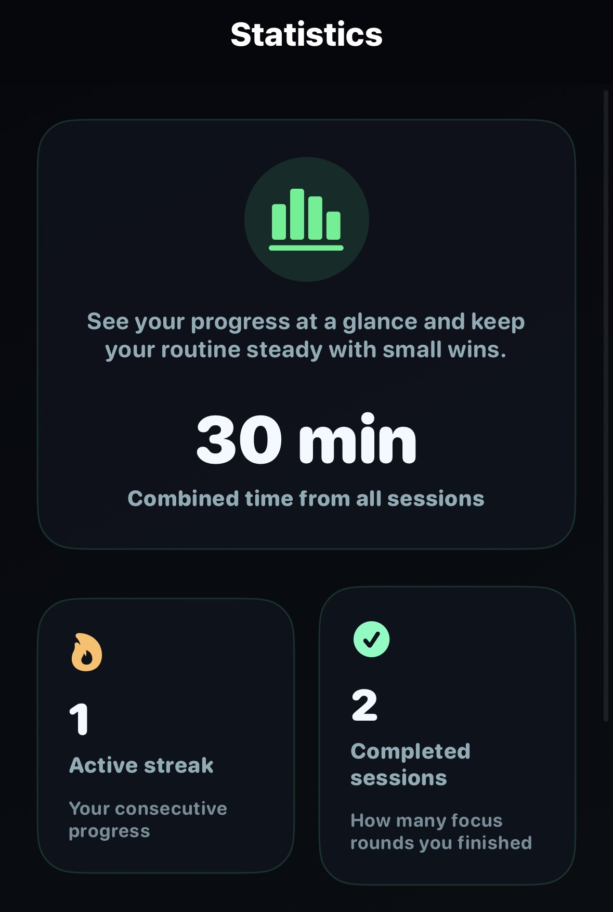
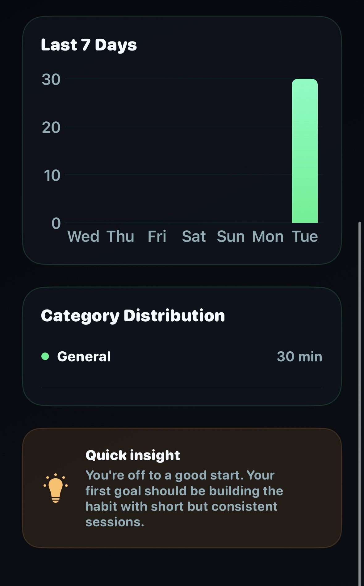
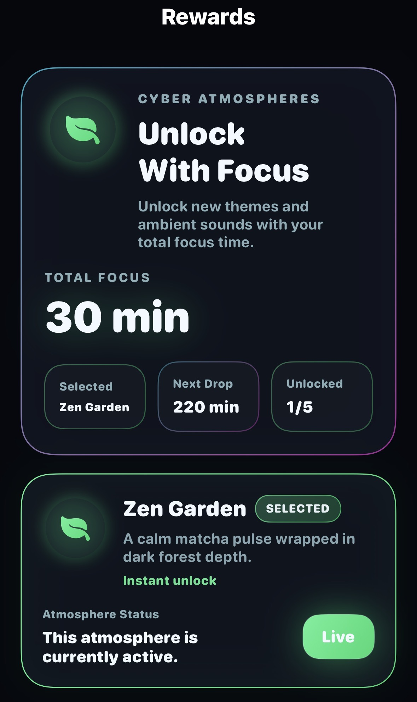
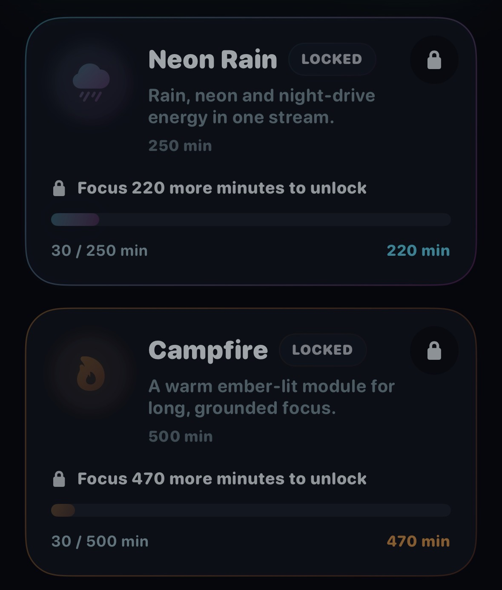
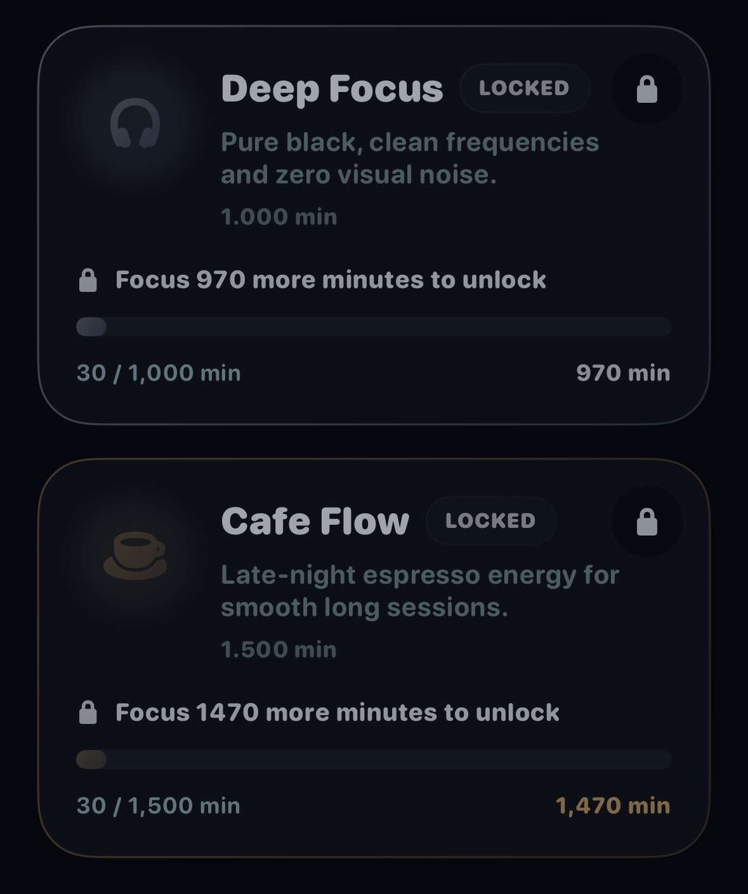
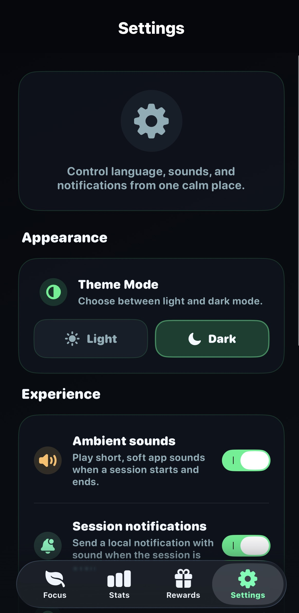
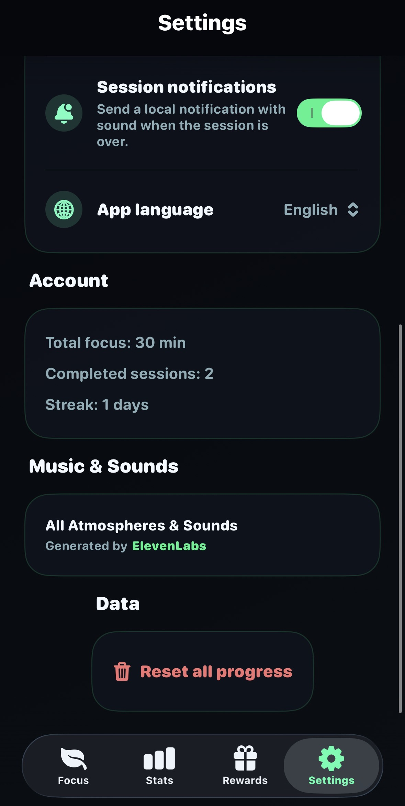

# MindIsland

A focus timer app that transforms your productivity sessions into a rewarding journey. Grow your neon egg, unlock unique atmospheres, and build consistent focus habits with ambient soundscapes.

## Features

- **Customizable Focus Timer** — 5 to 120 minute sessions with smart break intervals
- **5 Unlockable Atmospheres** — Zen Garden, Neon Rain, Campfire Glow, Deep Focus, Cafe Flow — each with unique sounds, colors, and visual identity
- **Ambient Soundscapes** — Background audio that keeps playing when you lock your screen
- **Widgets & Live Activities** — Home screen widgets and Dynamic Island support to track sessions at a glance
- **Statistics & Streaks** — Daily, weekly, and all-time focus tracking with category breakdown
- **Multi-Language** — English, Turkish, and Chinese Simplified
- **Privacy First** — All data stays on your device. No accounts, no tracking, no ads.

## Tech Stack

- SwiftUI
- SwiftData
- ActivityKit (Live Activities & Dynamic Island)
- WidgetKit
- AVFoundation
- Zero external dependencies

## Requirements

- iOS 17.0+
- Xcode 15.0+

## Screenshots

<table>
  <tr>
    <td align="center"><strong>Focus</strong></td>
    <td align="center"><strong>Statistics</strong></td>
    <td align="center"><strong>Statistics Details</strong></td>
  </tr>
  <tr>
    <td></td>
    <td></td>
    <td></td>
  </tr>
  <tr>
    <td align="center"><strong>Rewards</strong></td>
    <td align="center"><strong>Unlock Progress</strong></td>
    <td align="center"><strong>More Unlocks</strong></td>
  </tr>
  <tr>
    <td></td>
    <td></td>
    <td></td>
  </tr>
  <tr>
    <td align="center"><strong>Settings</strong></td>
    <td align="center"><strong>Settings Details</strong></td>
    <td></td>
  </tr>
  <tr>
    <td></td>
    <td></td>
    <td></td>
  </tr>
</table>

## Privacy

MindIsland does not collect, store, or transmit any personal data. See [Privacy Policy](PrivacyPolicy.md) for details.

## License

All rights reserved. Copyright 2026 Vedat Daglar.
